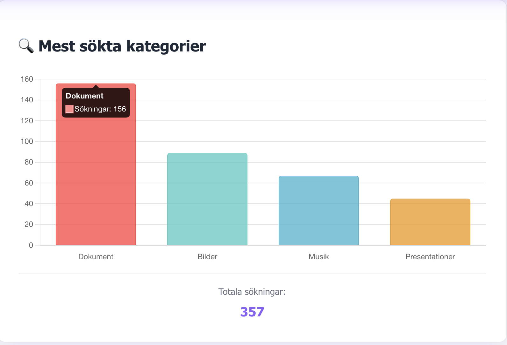
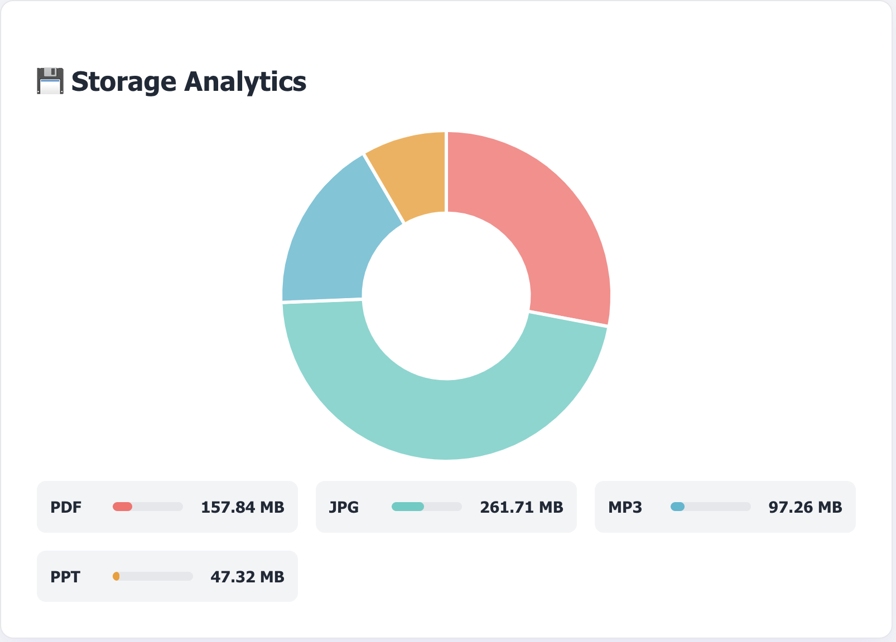
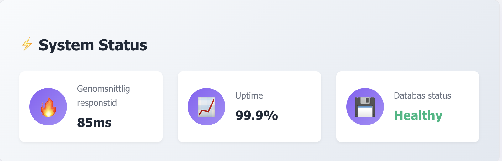

# MetaSearch-Pro - Enterprise Metadata Search Engine

**Developer:** Lucy Sonberg  
**Type:** Full-Stack Web Application  
**Tech Stack:** Node.js, Express, MySQL, Vanilla JavaScript  
**Status:** Ready  
**Last Updated:** September 14 2025  

## PROJECT OVERVIEW

MetaSearch-Pro is an enterprise-grade metadata search engine that extracts, indexes, and searches metadata from multiple file types. Built with modern web technologies, it provides instant search capabilities across PDF documents, JPG images, MP3 audio files, and PowerPoint presentations.

### **Key Features:**
- **Multi-format Support:** PDF, JPG, MP3, PPT metadata extraction
- **Advanced Search:** GPS-based search, 5 search operators, relevance scoring
- **Interactive Media:** Built-in audio player, image gallery, PDF viewer
- **Enterprise Dashboard:** Business intelligence with ROI calculator, Chart.js analytics
- **Enterprise Architecture:** RESTful API, MySQL database, responsive design
- **Advanced Filters:** Size, date, GPS, and operator-based filtering
- **User Experience:** Favorites system, search history, loading indicators
- **Production Ready:** Error handling, performance optimization, security best practices

## ✨ CORE FEATURES

### **Multi-Format Metadata Extraction:**
- **PDF Processing:** Title, author, creator, creation date, page count, PDF version
- **JPG EXIF Data:** Camera model, GPS coordinates, dimensions, photographer info
- **MP3 ID3 Tags:** Artist, album, genre, duration, year, album artwork
- **PowerPoint Metadata:** Title, company, slide count, word count, revision history

### **🎵 Interactive Media Features:**
- **HTML5 Audio Player:** Professional audio player with 30-second preview
- **Image Gallery with Lightbox:** Full-screen viewing with zoom and keyboard navigation
- **PDF Preview System:** Thumbnail generation and full-screen PDF viewer with page navigation

### **Advanced Search Capabilities:**
- **Multi-type Filtering:** Search specific file types (PDF, JPG, MP3, PPT)
- **5 Search Operators:** contains, equals, not_equals, greater_than, less_than
- **GPS-based Search:** Find JPG images by location coordinates with 5 GPS operators
- **Size & Date Filters:** Filter by file size (KB) and creation/modification dates
- **Relevance Scoring:** Intelligent ranking of search results
- **Search History:** Save and reuse previous searches
- **Debounced Search:** Optimized search with intelligent delay
- **Live Results:** Real-time search results with professional UI

### **🎨 Professional User Experience:**
- **Modern Design:** Clean, responsive design with CSS variables and professional styling
- **Advanced UI Components:** Toggle buttons, filter panels, and interactive elements
- **Favorites System:** Save and manage favorite files with database persistence
- **Cross-device Compatibility:** Perfect functionality on all devices
- **Keyboard Navigation:** Arrow keys for gallery and PDF navigation
- **Accessibility:** Screen reader support and ARIA labels

### **⚡ Technical Excellence:**
- **SOLID Principles:** Professional code structure following enterprise standards
- **Intelligent Metadata Handling:** Smart handling of missing or corrupted metadata
- **Robust Error Handling:** Graceful degradation when files have issues
- **Performance Optimization:** Lazy loading and efficient rendering

### **Enterprise Dashboard & Analytics:**
- **ROI Calculator:** Shows concrete business value - hours saved per week and money saved per month
- **File Type Distribution:** Interactive pie chart with real-time data from database
- **Storage Analytics:** Doughnut chart with visual progress bars showing storage usage by type
- **Search Statistics:** Bar chart displaying most searched categories and usage patterns
- **System Performance:** Monitoring with response times, uptime, and database status
- **Business Insights:** Three intelligent improvement suggestions based on system data
- **Chart.js Integration:** Professional animations with hover effects and tooltips
- **Responsive Design:** Perfect functionality across mobile, tablet, and desktop
- **Caching Strategy:** 30-minute intelligent caching for optimal performance

## 🚀 QUICK START

```bash
# Clone the repository
git clone [repository-url]
cd MetaSearch-Pro

# Install dependencies
npm install

# Start the server
npm start

# Open in browser
open http://localhost:3000
```

### **Prerequisites:**
- Node.js 16+ 
- MySQL database
- Modern web browser

> **Note:** For testing and evaluation instructions, see [docs/teacher-instructions.md](docs/teacher-instructions.md)

## API ENDPOINTS

### **Core Search & Metadata:**
- `GET /api/database-metadata` - Get all metadata with filtering
- `GET /api/search-history` - Get user search history
- `GET /api/favorites` - Get user favorites
- `POST /api/favorites` - Add file to favorites
- `DELETE /api/favorites/:filename` - Remove file from favorites

### **Dashboard Analytics:**
- `GET /api/dashboard-analytics` - Get business intelligence data

### **Example API Usage:**
```javascript
// Get all metadata
fetch('/api/database-metadata')
  .then(response => response.json())
  .then(data => console.log(data));

// Search with filters
fetch('/api/database-metadata?search=health&fileType=PDF')
  .then(response => response.json())
  .then(data => console.log(data));

// Add to favorites
fetch('/api/favorites', {
  method: 'POST',
  headers: { 'Content-Type': 'application/json' },
  body: JSON.stringify({ filename: 'document.pdf' })
});
```

## 📁 PROJECT STRUCTURE

```
MetaSearch-Pro/
├── index.js                    # Express.js backend server
├── models.js                   # MySQL database models (Sequelize ORM)
├── database.js                 # MySQL database connection
├── package.json               # Project configuration and dependencies
├── package-lock.json          # Dependency lock file
├── credentials-example.json   # Database credentials template
├── convert-csv-to-json.js     # CSV to JSON conversion utility
├── GIT-BRANCHING-GUIDE.md     # Git workflow guide
├── todo.md                    # Project task management
├── data/
│   ├── ppt-metadata.json     # PowerPoint metadata (1001 records)
│   └── _lcwa_gov_powerpoint_metadata.csv  # CSV metadata
├── frontend/
│   ├── index.html            # Main web application
│   ├── main.js              # Frontend logic (SOLID principles)
│   ├── style.css            # Professional styling and responsive design
│   ├── about.html           # About page
│   ├── blog.html            # Blog section
│   ├── contact.html         # Contact page
│   ├── contact.js           # Contact form handling
│   ├── dashboard.html       # Analytics dashboard
│   ├── dashboard.js         # Dashboard functionality
│   ├── pdfs/                # PDF files (Git ignored)
│   ├── jpgs/                # JPG images (Git ignored)
│   ├── mp3s/                # MP3 audio files (Git ignored)
│   └── ppts/                # PowerPoint files (Git ignored)
├── docs/
│   ├── teacher-instructions.md  # Testing and evaluation guide
│   └── screenshots/         # Project screenshots and documentation
├── projektuppgift/          # Project assignment and blog posts
│   ├── README.md            # Blog section overview
│   ├── uppgift.md           # Original project assignment
│   ├── metadata-och-webbanalys.md  # Professional blog post
│   ├── semantisk-webb-mikrodata.md  # Technical blog post
│   └── webbanalys-for-foretag.md   # Business blog post
├── DOKUMENTATION.md          # Detailed project documentation
└── README.md                 # This file - project overview
```

## 🔧 TECHNOLOGY STACK

- **Backend:** Node.js, Express.js, MySQL with Sequelize ORM
- **Frontend:** Vanilla JavaScript (ES6+), HTML5, CSS3 with CSS Grid/Flexbox
- **Data Visualization:** Chart.js (CDN) for enterprise dashboard analytics
- **PDF Processing:** PDF.js (CDN), pdf-parse-fork for metadata extraction
- **Image Processing:** exif-parser, exif-reader, Canvas API for thumbnails
- **Audio Processing:** music-metadata, HTML5 Audio API
- **PowerPoint Processing:** JSON-based metadata (Library of Congress)
- **File System:** Node.js fs module with chokidar for file monitoring
- **Architecture:** SOLID principles, RESTful API, Responsive Design, Caching Strategy

## INTERACTIVE FEATURES

### **🎵 MP3 PLAYER:**
- **HTML5 Audio API:** Professional audio player with custom controls
- **30-second Preview:** Limited playback length for copyright protection
- **Playback Controls:** Play/pause, speed control, progress bar
- **Responsive Design:** Adapts to screen size

### **IMAGE GALLERY WITH LIGHTBOX:**
- **Full-screen Viewing:** Professional lightbox experience
- **Zoom Functionality:** Built-in zoom for detail viewing
- **Keyboard Navigation:** Arrow keys for navigation between images
- **EXIF Metadata Display:** Toggle to show/hide camera information
- **Responsive Grid:** Automatic adaptation to screen size

### **📄 PDF PREVIEW SYSTEM:**
- **PDF.js Integration:** Thumbnail previews of first page
- **Full-screen Viewer:** Professional PDF viewer with zoom controls
- **Page Navigation:** ◀ Previous / Next ▶ buttons
- **Keyboard Support:** Arrow keys for page navigation
- **Zoom Controls:** + and - for in/out zooming

## EXTRACTED METADATA

### **PDF Files:**
- **Title:** From PDF metadata or extracted from text
- **Author:** From PDF metadata or extracted from text
- **Creator:** Program that created the PDF
- **Creation Date:** When the PDF was created
- **Modification Date:** When the PDF was last modified
- **Pages:** Number of pages in the PDF
- **File Size:** In user-friendly format
- **PDF Version:** Technical version of the PDF format

### **JPG Images:**
- **Camera:** Manufacturer and model
- **Dimensions:** Image size in pixels
- **Date:** When the image was taken
- **GPS Coordinates:** Location where the image was taken
- **Photographer:** From EXIF data

### **MP3 Files:**
- **Artist:** Musician or group
- **Album:** Album title
- **Genre:** Music genre
- **Duration:** Play time in seconds
- **Year:** Release year

### **PowerPoint Files:**
- **Title:** From metadata or intelligent extraction
- **Company:** Creating organization
- **Slides:** Number of presentations
- **Words:** Number of words in the presentation
- **Revision:** Revision number
- **Creation Date:** When the presentation was created

## 🛡️ SECURITY & BEST PRACTICES

- **Secure Configuration:** Environment variables for sensitive data
- **Gitignore Protection:** Personal files and test data are protected
- **Industry Standards:** Follows professional development best practices
- **Error Handling:** Comprehensive error handling and logging

## 💼 BUSINESS VALUE & ROI

### **PROBLEMS SOLVED:**
- **Time Constraints:** Manual file management takes hours per day
- **Information Loss:** Important documents get lost in archives
- **Inefficient Search:** "Where is the March contract?" = 2 hours of searching
- **Security Risks:** Documents shared via email/cloud without control

### **✅ SOLUTIONS:**
- **⚡ Instant Search:** 2 hours → 30 seconds
- **Complete Overview:** All documents indexed and searchable
- **🤝 Secure Sharing:** Controlled access to metadata
- **Proactive Insights:** Automatic categorization and tagging

### **💰 ROI CALCULATION:**
```
Company with 10,000 documents:
- Manual handling: 20 hours/week × $100/hour = $2,000/week
- With MetaSearch-Pro: 2 hours/week × $100/hour = $200/week
- Annual savings: $1,800/week × 52 weeks = $93,600/year
- System cost: $6,000 (development) + $600/month (SaaS)
- Net profit first year: $93,600 - $13,200 = $80,400
```

### **🚀 FUTURE POSSIBILITIES:**
- **AI Integration:** Automatic categorization and summaries


## 👤 CONTACT

**Developer:** Lucy Sonberg  
**Project:** MetaSearch-Pro - Enterprise Metadata Search Engine  
**Status:** Ready  
**Course:** Metadata - Individual Project  

## SCREENSHOTS

### Enterprise Analytics Dashboard

*Complete dashboard view with ROI metrics, file type distribution, and business intelligence*

### 💰 Business Intelligence & ROI

*ROI calculator showing time saved, efficiency improvements, and cost savings*

### 📁 File Type Distribution

*Interactive pie chart displaying distribution of PDF, JPG, MP3, and PPT files*

### Search Analytics

*Bar chart showing most searched categories and user behavior patterns*

### Storage Analytics

*Storage management with file size distribution and usage analytics*

### ⚙️ System Status

*System health monitoring with performance metrics and database status*

> **Detailed Screenshot Guide:** See [docs/screenshots/README.md](docs/screenshots/README.md) for comprehensive descriptions and portfolio usage recommendations.


## PROJECT STATISTICS

- **File Types Supported:** 4 (PDF, JPG, MP3, PPT)
- **Test Files:** 387 files indexed in database
- **API Endpoints:** 9 RESTful endpoints (including dashboard analytics)
- **Database Records:** 387 metadata entries with live analytics
- **Dashboard Features:** ROI calculator, Chart.js visualizations, business intelligence
