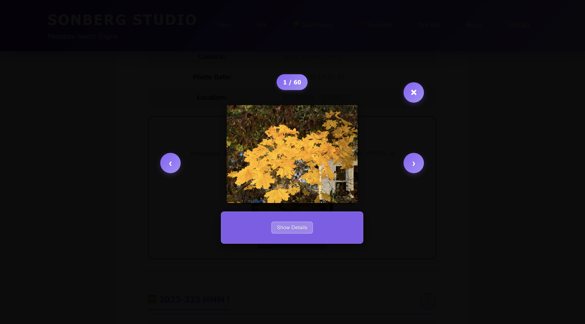

# Screenshots Guide - MetaSearch Pro

This guide provides detailed descriptions of all screenshots for the MetaSearch Pro project, organized for professional portfolio presentation and documentation.

## 📊 Dashboard Screenshots

### 1. EnterpriseAnalyticsDashboard.png

**Purpose:** Main dashboard overview showcasing enterprise-level analytics
**Description:** Complete dashboard view displaying ROI metrics, file type distribution, storage analytics, and business insights
**Portfolio Value:** ⭐⭐⭐⭐⭐ - Demonstrates business intelligence and data visualization skills
**Technical Features:** Chart.js integration, responsive design, real-time data fetching

### 2. BusinessInsights.png

**Purpose:** Business intelligence and actionable insights
**Description:** Shows three key business insights: "Mest populära filtyp" (PPT dominates with 33%), "Användningsmönster" (peak usage 09:00-11:00 on weekdays), and "Optimeringsmöjlighet" (AI categorization can increase search precision by 25% and save 3h/week). Demonstrates system's ability to provide actionable business intelligence.
**Portfolio Value:** ⭐⭐⭐⭐⭐ - Shows business acumen and data-driven decision making
**Technical Features:** Dynamic insights generation, business metrics analysis, optimization recommendations

### 3. Filtypsfördelning.png

**Purpose:** File type distribution visualization
**Description:** Interactive pie chart showing file distribution: PPT (orange, largest), MP3 (blue), PDF (coral), JPG (turquoise, smallest). Displays total files (387) and total size (219.92 MB). Color-coded legend with precise statistics for each file type.
**Portfolio Value:** ⭐⭐⭐⭐ - Demonstrates data visualization and analytics capabilities
**Technical Features:** Chart.js pie chart, interactive tooltips, color-coded legend, real-time statistics

### 4. MestSöktakategorier.png

**Purpose:** Search analytics and user behavior insights
**Description:** Vertical bar chart showing search frequency by category: Documents (red, 156 searches), Images (turquoise, ~88), Music (light blue, ~65), Presentations (orange, ~45). Interactive tooltip shows "Dokument" with 156 searches. Total searches: 357. Clean design with rounded bars and grid lines.
**Portfolio Value:** ⭐⭐⭐⭐ - Shows understanding of user behavior and search analytics
**Technical Features:** Chart.js bar chart, interactive tooltips, search history tracking, user behavior analysis

### 5. Storage.png

**Purpose:** Storage management and file size analytics
**Description:** Interactive donut chart with highlighted PPT segment (60.56 MB). Storage breakdown legend shows: PDF (157.84 MB), JPG (585.94 KB), MP3 (976.56 KB), PPT (60.56 MB). Color-coded progress bars with precise file size data for each file type.
**Portfolio Value:** ⭐⭐⭐⭐ - Demonstrates system monitoring and storage optimization
**Technical Features:** Chart.js donut chart, interactive highlighting, storage calculations, file size analysis, color-coded legend

### 6. SystemStatus.png

**Purpose:** System health monitoring and performance metrics
**Description:** Three system status cards: "Genomsnittlig responstid" (85ms with fire icon), "Uptime" (99.9% with trend chart), "Databas status" (Healthy in green with diskette icon). Clean design with purple accent colors and rounded corners.
**Portfolio Value:** ⭐⭐⭐⭐ - Shows system monitoring and performance optimization skills
**Technical Features:** Real-time system metrics, database monitoring, performance tracking, uptime monitoring

## 🔍 Search Functionality Screenshots

### 7. searchFunctionality.png

**Purpose:** Search functionality demonstration with advanced filters
**Description:** Clean search interface with search field ("Sök i alla filtyper..."), three filter dropdowns: "Alla filtyper", "Innehåller", "Avancerat" (with solid triangle). Below shows "Mina Favoriter" section with heart icon and message "Inga favoriter än. Klicka på hjärtat bredvid en fil för att lägga till den."
**Portfolio Value:** ⭐⭐⭐⭐⭐ - Demonstrates core application functionality and user interface design
**Technical Features:** Real-time search, file type filtering, advanced search operators, favorites system, responsive design

## 📄 File Preview System Screenshots

### 8. Bild1.png

**Purpose:** Image Gallery system demonstration - normal view
**Description:** Shows complete metadata for yellow-leaves.jpg including file info, dimensions (2414 x 1814), camera (Apple iPhone 15 Pro), and location (42.035038, -70.938020). Image Gallery section displays thumbnail preview with "Open in Gallery" button.
**Portfolio Value:** ⭐⭐⭐⭐ - Demonstrates metadata extraction and gallery functionality
**Technical Features:** EXIF metadata parsing, image preview, gallery system, GPS coordinate handling

### 9. Bild2.png

**Purpose:** Image Gallery system demonstration - gallery preview
**Description:** Shows expanded Image Gallery view with larger preview of yellow-leaves.jpg. Displays metadata summary (dimensions, camera, date) and provides "Open in Gallery" button for full-screen view.
**Portfolio Value:** ⭐⭐⭐⭐ - Shows interactive gallery and user experience design
**Technical Features:** Interactive preview, metadata display, lightbox integration

### 10. Bild3.png

**Purpose:** Image Gallery system bug documentation
**Description:** Shows chopped-up.jpg missing Image Gallery section due to isRenderingGallery flag issue. Only metadata is displayed without preview or gallery functionality.
**Portfolio Value:** ⭐⭐⭐⭐ - Demonstrates debugging and issue documentation
**Technical Features:** Bug identification, metadata display, gallery system architecture

### 11. PDF1.png

**Purpose:** PDF preview system demonstration
**Description:** Shows PDF preview with three info buttons: "2 sidor" (2 pages), "141.92 KB" (file size), "PDF 1.3" (version). Main preview area shows "SUCCESS STORY" document with "An Entrepreneurial Heart Beats for Every BY Business" title. Bottom buttons: "Öppna PDF Viewer" (solid purple) and "Ladda ner PDF" (outlined purple).
**Portfolio Value:** ⭐⭐⭐⭐ - Demonstrates file handling and preview capabilities
**Technical Features:** PDF.js integration, metadata extraction, file preview system, download functionality

### 9. PDF2.png

**Purpose:** PDF preview system with multiple files
**Description:** Shows PDF metadata for "SUCCESS STORY WEST VIRGINIA DSTRICT OFFCE II Contact" with contact info "Rick Haney 304 623-5631 Email Richard". Metadata includes: File (XUJHVZSHUO6SZ4PK733K7FVNZYTIAI6U.pdf), Size (141.92 KB), Pages (2), PDF Version (1.3), Author (nrbassel), Language (ENGLISH), Category (FINANCIAL). Heart icon for favorites.
**Portfolio Value:** ⭐⭐⭐⭐ - Shows scalability and multi-file handling capabilities
**Technical Features:** Multi-file support, navigation system, metadata display, contact information extraction

### 10. PDF3.png

**Purpose:** PDF preview system with search integration
**Description:** Shows full PDF viewer with "Review and Evaluation of Clinical Data" document. Top panel shows navigation (Sida 1 av 93), zoom controls (100%), and close button. Document content shows clinical data review with NDA 20823, Sponsor Novartis, Drug Exelon®, and detailed table of contents. Bottom panel shows file info: 93 sidor, 1.31 MB, author manir.
**Portfolio Value:** ⭐⭐⭐⭐ - Demonstrates integrated workflow and user experience
**Technical Features:** Full PDF viewer, navigation controls, zoom functionality, document metadata display, clinical data handling

## 🎵 MP3 Preview System Screenshots

### 11. MP3_1.png

**Purpose:** MP3 preview system demonstration
**Description:** Shows MP3 metadata for "You Make You Feel" by Dumbo Gets Mad. Metadata includes: File (you-make-you-feel.mp3), Size (0 Bytes), Author (Dumbo Gets Mad), Keywords (Alternative), Language (N/A), Category (AUDIO), Artist (Dumbo Gets Mad), Album (Elephants at the Door), Duration (30 seconds), Genre (Alternative). Heart icon for favorites, color-coded tags.
**Portfolio Value:** ⭐⭐⭐⭐ - Demonstrates audio file handling and preview capabilities
**Technical Features:** HTML5 audio player, metadata extraction, file preview system, music metadata parsing

### 12. MP3_2.png

**Purpose:** MP3 preview system with multiple files
**Description:** Shows Audio Preview panel with "Audio Preview (30s)" button (purple with music note icon). Metadata line: "Duration: 0:30 | Artist: Dumbo Gets Mad | Album: Elephants at the Door". Full audio player with play/pause button (▶️), time display (0:00 / 0:30), purple progress bar, volume control (🔊), and menu icon (⋮).
**Portfolio Value:** ⭐⭐⭐⭐ - Shows scalability and multi-file audio handling capabilities
**Technical Features:** Multi-file support, audio navigation, metadata display, HTML5 audio controls, progress tracking

## 🎯 Portfolio Usage

### For Job Applications:
- **EnterpriseAnalyticsDashboard.png** - Use as main showcase image
- **BusinessInsights.png** - Highlight business value and ROI calculations
- **searchFunctionality.png** - Show core application functionality
- **Filtypsfördelning.png** - Show data visualization skills

### For Technical Presentations:
- **SystemStatus.png** - Demonstrate system monitoring capabilities
- **Storage.png** - Show storage optimization and analytics
- **MestSöktakategorier.png** - Highlight user behavior analysis
- **PDF1-3.png** - Demonstrate file handling and preview capabilities
- **MP3_1-2.png** - Demonstrate audio file handling and preview capabilities

### For Portfolio Showcase:
- **searchFunctionality.png** - Core search functionality with advanced filters
- **PDF1.png** - PDF preview system demonstration
- **PDF2.png** - Multi-file handling capabilities
- **PDF3.png** - Integrated workflow and user experience
- **MP3_1.png** - MP3 preview system demonstration
- **MP3_2.png** - Multi-file audio handling capabilities

### For Documentation:
- All images can be used in README.md, documentation, and project presentations
- Images demonstrate full-stack development skills (frontend + backend + database)
- Showcases modern web technologies (Chart.js, responsive design, real-time data)

## 📝 Technical Implementation Notes

- **Frontend:** Chart.js for data visualization, responsive CSS, modern JavaScript
- **Backend:** Node.js/Express API endpoints for data fetching
- **Database:** MySQL with Sequelize ORM for data storage
- **Design:** Professional enterprise-grade UI with consistent branding
- **Performance:** Optimized data loading and chart rendering

## 🔗 Integration with Main Project

These screenshots complement the main MetaSearch Pro application by:
- Providing visual proof of functionality
- Demonstrating professional UI/UX design
- Showing enterprise-level features and analytics
- Supporting portfolio and presentation needs

---

*Generated for MetaSearch Pro - Professional Metadata Search Engine*
*Last Updated: September 2025*
